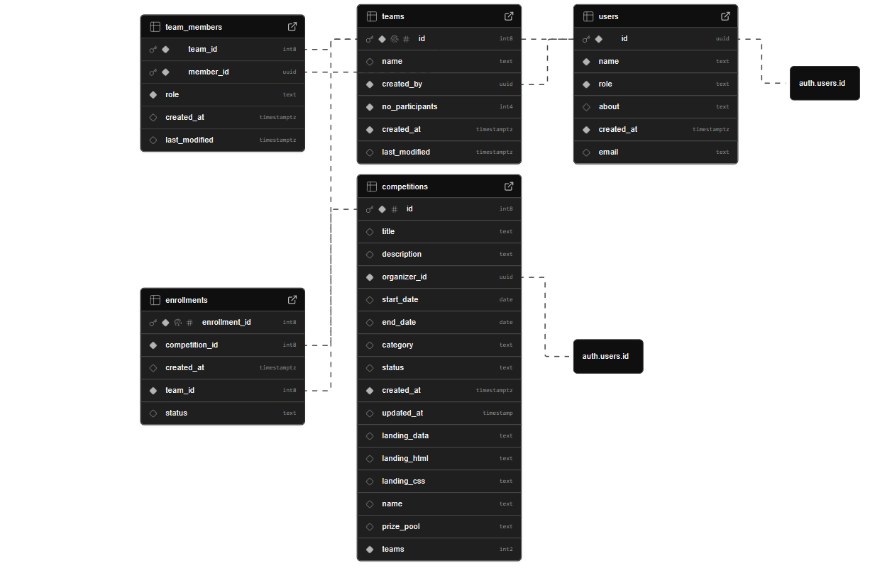

<div align="center">
  <!-- Auto-playing GIF demo -->
  
  
  <h1>🏆 Vinnova Competition Platform 🏆</h1>
  
  <p>
    <em>Empowering competitive collaboration through modern technology</em>
  </p>
</div>

---

Welcome to the **Vinnova Competition Platform**! This is a comprehensive solution for managing competitive events, team formations, and participant enrollments. Built with modern technologies, it provides features for both competitors and organizers to create, manage, and participate in various competitions.

## Table of Contents
* [Features](#features)
* [Tech Stack](#tech-stack)
* [Prerequisites](#prerequisites)
* [Getting Started](#getting-started)
* [Configuration](#configuration)
  * [Environment Variables](#environment-variables)
  * [Supabase Database](#supabase-database)
  * [Database Structure](#database-structure)
  * [Google Services](#google-services)
  * [AI Integration](#ai-integration)
* [Project Structure](#project-structure)
* [Executing the Application](#executing-the-application)
* [API Endpoints](#api-endpoints)

## Features

### Competition Management
- **Competition Creation & Management**
  - Create and manage competitive events
  - Set competition rules, deadlines, and requirements
  - Track competition progress and status
  - Support for multiple competition types

- **Custom Landing Page Builder**
  - **GrapesJS Studio Integration**: Drag-and-drop visual editor
  - **Dynamic Content**: Auto-populate competition details
  - **Asset Management**: Upload and manage images, icons, and media
  - **Publishing System**: One-click page deployment

### Team Collaboration
- **Team Formation & Management**
  - Create and join teams
  - Team member invitation system
  - Role-based team hierarchy (Leader/Member)
  - Team profile and information management

### User Roles & Authentication
- **Multi-Role System**
  - **Competitors**: Participate in competitions, form teams
  - **Organizers**: Create and manage competitions
  - Secure authentication with Supabase Auth
  - Profile management and user verification

### Enrollment & Registration
- **Competition Registration**
  - Team-based enrollment system
  - Registration status tracking
  - Automated enrollment management
  - Competition capacity control

### AI-Powered Features
- **Intelligent Chatbot**
  - Google Gemini AI integration
  - Competition guidance and support

### Communication & Notifications
- **Email Integration**
  - Gmail API integration for notifications
  - Competition updates and announcements

### Dashboard & Analytics
- **Comprehensive Dashboards**
  - Role-specific dashboard views
  - Enrollmets and Competition
  - User and team activity monitoring

## Tech Stack

### Frontend
- **Next.js 15** with App Router
- **React 19** with TypeScript
- **Tailwind CSS** for styling
- **Radix UI** components
- **Framer Motion** for animations
- **Editor.js** for rich content editing
- **GrapesJS Studio** for visual page building

### Backend
- **Ballerina** runtime and services
- **PostgreSQL** database via Supabase
- **RESTful API** architecture
- **JWT Authentication** with interceptors

### External Services
- **Supabase** (Database, Auth, Storage)
- **Google Gemini AI** for chatbot
- **Gmail API** for email services
- **Google OAuth** for authentication

## Prerequisites

### Backend Requirements
- **Ballerina** 2201.12.7 or higher
- **Java 21** (for PostgreSQL driver)
- **PostgreSQL** database (via Supabase)
- **Google Cloud Platform** account with:
  - Gmail API enabled
  - Google Gemini AI API access
  - OAuth 2.0 configured
- **Supabase** account and project

### Frontend Requirements
- **Node.js** 18.x or higher
- **npm** 9.x or higher
- Modern web browser with JavaScript enabled
- **Next.js** 15.x

### Development Tools
- IDE with TypeScript support (VS Code recommended)
- Git for version control
- API testing tool (Postman recommended)

## Getting Started

To get started with this project, clone the repository and install the necessary dependencies for both the client and server.

```bash
git clone https://github.com/TumashaD/iwb-tetra.git
cd iwb-tetra
```

## Configuration

### Environment Variables

#### Backend Configuration
The backend configuration is managed through the `Config.toml` file located in the Server directory. Here is a sample configuration:

```toml
# Supabase Configuration
supabaseJwtSecret = "your-supabase-jwt-secret"
supabaseUrl = "https://your-project.supabase.co/auth/v1"
supabaseStorageUrl = "https://your-project.storage.supabase.co/storage/v1"
supabaseAnonKey = "your-supabase-anon-key"

# Server Configuration
serverPort = 8080

# Database Configuration (Supabase PostgreSQL)
dbHost = "db.your-project.supabase.co"
dbPort = 5432
dbName = "postgres"
dbUser = "postgres"
dbPassword = "your-database-password"

# Google Gemini AI Configuration
geminiApiKey = "your-gemini-api-key"

# Gmail API Configuration
refreshToken = "your-gmail-refresh-token"
clientId = "your-google-client-id"
clientSecret = "your-google-client-secret"
```

#### Frontend Configuration
The frontend configuration is managed through environment variables. Create a `.env.local` file in the Client directory:

```env
NEXT_PUBLIC_SUPABASE_URL=https://your-project.supabase.co
NEXT_PUBLIC_SUPABASE_ANON_KEY=your-supabase-anon-key
SUPABASE_JWT_SECRET = your-supabase-jwt-secret
```

### Supabase Database
1. Create a Supabase project at [supabase.com](https://supabase.com)
2. Set up the required database tables (see Database Structure below)
3. Configure Row Level Security (RLS) policies for secure data access
4. Enable realtime subscriptions for live updates
5. Get your project URL and anon key from the Supabase dashboard
6. Configure authentication providers (Email, OAuth)

### Database Structure

Our platform uses a PostgreSQL database hosted on Supabase with the following schema:

<div align="center">
  
  
  <p><em>📊 Complete database schema showing all tables and relationships</em></p>
</div>

### Google Services

#### Gmail API Setup
1. Go to [Google Cloud Console](https://console.cloud.google.com)
2. Create a new project or select existing one
3. Enable the Gmail API
4. Create OAuth 2.0 credentials
5. Configure OAuth consent screen
6. Generate refresh token for server-to-server communication

#### Google Gemini AI Setup
1. Visit [Google AI Studio](https://aistudio.google.com)
2. Create an API key for Gemini
3. Configure the API key in your Config.toml

### AI Integration
The platform integrates with Google Gemini AI for:
- Intelligent chatbot assistance
- Competition guidance
- Real-time user support

## Project Structure

```
iwb-tetra/
├── Client/                          # Next.js Frontend Application
│   ├── src/
│   │   ├── app/                     # App Router pages
│   │   │   ├── auth/                # Authentication pages
│   │   │   ├── competitions/        # Competition listing and details
│   │   │   ├── dashboard/           # User dashboards
│   │   │   │   ├── competitor/      # Competitor dashboard
│   │   │   │   └── organizer/       # Organizer dashboard
│   │   │   └── settings/            # User settings
│   │   ├── components/              # Reusable UI components
│   │   │   ├── auth/                # Authentication components
│   │   │   ├── editor/              # Rich text editor
│   │   │   └── ui/                  # Base UI components
│   │   ├── contexts/                # React contexts
│   │   ├── hooks/                   # Custom React hooks
│   │   ├── lib/                     # Utility libraries
│   │   ├── services/                # API service layers
│   │   └── types/                   # TypeScript type definitions
│   ├── public/                      # Static assets
│   └── package.json                 # Frontend dependencies
├── Server/                          # Ballerina Backend Application
│   ├── modules/
│   │   ├── auth/                    # Authentication services
│   │   ├── services/                # Business logic services
│   │   │   ├── aiService.bal        # AI chatbot service
│   │   │   ├── competitionService.bal # Competition management
│   │   │   ├── enrollmentService.bal  # Registration management
│   │   │   ├── gmailService.bal     # Email services
│   │   │   ├── organizerService.bal # Organizer-specific services
│   │   │   ├── teamService.bal      # Team management
│   │   │   └── userService.bal      # User management
│   │   └── supabase/                # Database and storage utilities
│   ├── main.bal                     # Main server entry point
│   ├── Ballerina.toml               # Project configuration
│   └── Config.toml                  # Environment configuration
└── README.md                        # Project documentation
```

## Executing the Application

### Backend (Ballerina Server)
Navigate to the Server directory and run the Ballerina application:

```bash
cd Server
bal run
```

The server will start on the configured port (default: 8080) and expose the following services:
- Competition Service: `/competitions`
- User Service: `/users`
- Team Service: `/teams`
- Enrollment Service: `/enrollments`
- AI Service: `/ai`
- Gmail Service: `/gmail`
- Organizer Service: `/organizer`

### Frontend (Next.js Application)
Navigate to the Client directory and run the development server:

```bash
cd Client
npm install
npm run dev
```

The frontend application will be available at `http://localhost:3000`


## Key Features Walkthrough

### For Competitors
1. **Registration & Authentication**
   - Sign up with email verification
   - Secure login with Supabase Auth
   - Profile management and customization

2. **Team Management**
   - Create teams with custom names and member limits
   - Invite team members via email search
   - Manage team roles (Leader/Member)
   - View team statistics and activity

3. **Competition Participation**
   - Browse available competitions
   - Register teams for competitions
   - Track enrollment status
   - Receive updates and notifications

4. **Dashboard & Analytics**
   - Personal competition history
   - Team performance metrics
   - Upcoming competition schedules

### For Organizers
1. **Competition Creation & Landing Pages**
   - **Visual Page Builder**: Create stunning custom competition webpages using GrapesJS Studio
   - **Drag-and-Drop Editor**: Professional visual editor with real-time preview
   - **Pre-built Templates**: Competition-focused layouts and components
   - **Asset Management**: Upload and organize images, icons, and media files
   - **Dynamic Content Integration**:Use dynamic placeholders that update with competition data
   - **Advanced Customization**: Full styling control with CSS editor, and component layouts
   - **Publish**: One-click deployment and real-time preview

2. **Competition Management**
   - Create detailed competition descriptions
   - Set rules, deadlines, and requirements
   - Configure registration parameters
   - Manage competition lifecycle and status

3. **Team Management**
   - View all registered teams
   - Approve, reject and manage registrations
   - Send bulk communications
   - Track participation metrics

4. **Communication Tools**
   - Send targeted emails to participants
   - Broadcast announcements
   - Individual team communication

## Technology Highlights

- **Modern Frontend Stack**: Next.js 15 with React 19 and TypeScript
- **Visual Page Builder**: GrapesJS Studio for professional webpage creation
- **Robust Backend**: Ballerina with PostgreSQL and REST APIs
- **Real-time Features**: Live updates and notifications
- **AI Integration**: Google Gemini for intelligent assistance
- **Responsive Design**: Mobile-first approach with Tailwind CSS
- **Security**: JWT authentication with role-based access control
- **Cloud Storage**: Supabase for database, authentication, and file storage

## Development Roadmap

- [ ] Advanecd submission management
- [ ] Real-time chat system
- [ ] Competition analytics dashboard
- [ ] Mobile application
- [ ] Advanced AI features for competition recommendations
- [ ] Payment integration for premium competitions and rewards


**Vinnova Competition Platform** - Empowering competitive collaboration through modern technology.
